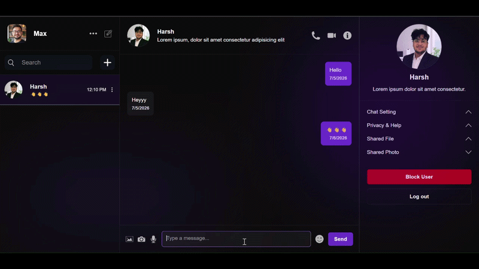
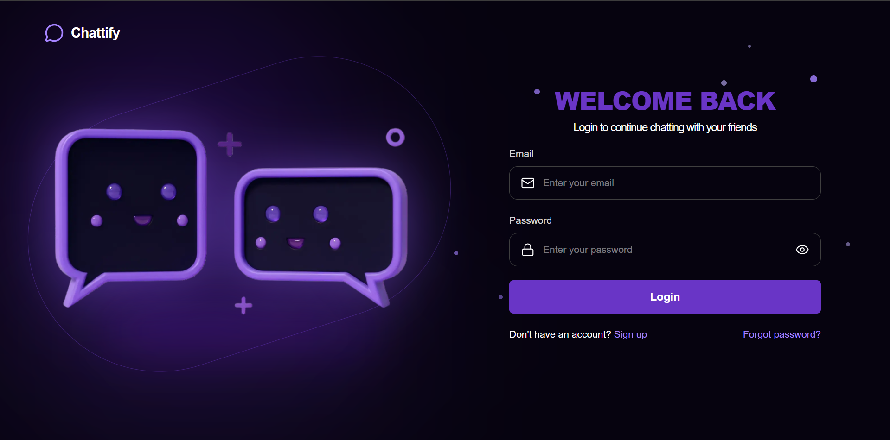
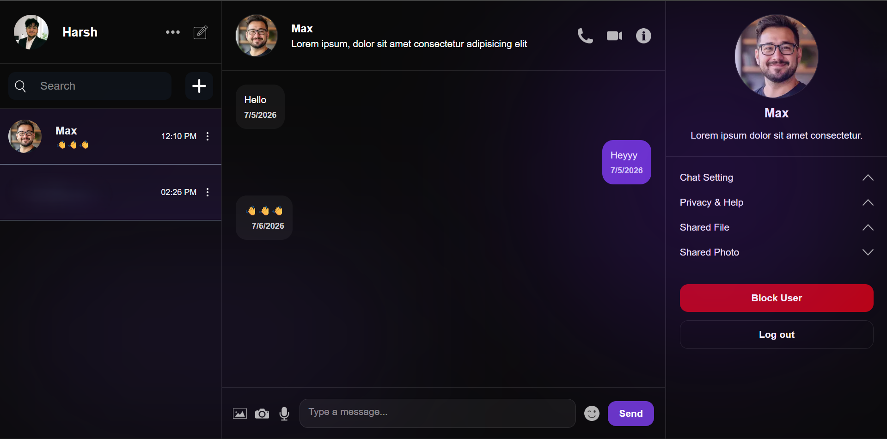
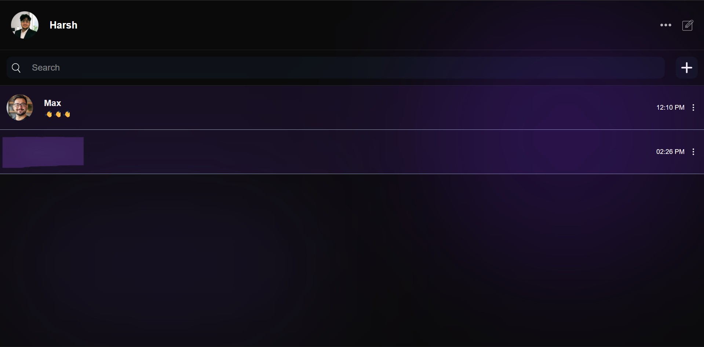

# 📱💭 Chattify

> A modern real-time chat application that helps users connect through seamless and instant messaging.

---

## 🌟 Overview

**Chattify** is a modern messaging platform built to provide a fast, responsive, and user-friendly chatting experience.

Users can create an account, connect with others, and exchange messages in real time. The application focuses on delivering smooth performance, clean UI, and an intuitive user experience.

---

## 🚀 Live Demo

🔗 **Live:** https://chattify-harsh.vercel.app/

---

## 🧠 Features

✅ Secure user authentication (Login & Signup)

✅ Real-time one-to-one messaging

✅ User search and discover

✅ Friend management

✅ User profiles

✅ Online user status

✅ Real-time message updates

✅ Responsive design for desktop and mobile

✅ Smooth animations using Framer Motion

✅ Modern and intuitive user interface

> **🚧 Upcoming Features**
>
> * 🎙️ Voice Notes
> * 📁 Media & File Sharing
> * 📞 Voice Calling
> * 🎥 Video Calling
> * ⚙️ Advanced User Settings

---

## 🛠️ Tech Stack

| Category               | Technologies                       |
| ---------------------- | ---------------------------------- |
| **Frontend**           | Next.js 15, React 19, Tailwind CSS |
| **Backend & Database** | Firebase                           |
| **Authentication**     | Firebase Authentication            |
| **Real-time Services** | Firebase Firestore                 |
| **Animation**          | Framer Motion                      |
| **Package Manager**    | pnpm                               |
| **Hosting**            | Vercel                             |

---

## 📸 Screenshots

> Add screenshots or GIFs showcasing your application.

<h1 align="center">📽️ Application GIF</h1>


<h1 align="center">🛬 Landing Page</h1>


<h1 align="center">🔐 Log in Page</h1>


<h1 align="center">🗨️ Chat Page</h1>


<h1 align="center">📋 Chats List Page</h1>


---

## ⚙️ Installation & Setup

Clone the repository and install dependencies.

```bash
# Clone the repository
git clone https://github.com/Harshjs-Gupta/chattify.git

# Navigate to the project
cd chattify

# Install dependencies
pnpm install

# Start the development server
pnpm dev
```

Open your browser and visit:

```
http://localhost:3000
```

---

## 📂 Project Structure

```
app/
components/
hooks/
lib/
context/
firebase/
public/
types/
utils/
```

---

## ✨ Future Improvements

* Voice Calling
* Video Calling
* Voice Messages
* Media & File Sharing
* Group Chats
* Message Reactions
* Read Receipts
* Typing Indicator
* Push Notifications
* Chat Backup
* Advanced Privacy Settings
* Message Search

---

## 🤝 Contributing

Contributions, issues, and feature requests are welcome.

Feel free to fork the repository and submit a pull request.

---

## 📄 License

This project is licensed under the MIT License.

---

## 👨‍💻 Author

**Harsh Gupta**

* GitHub: https://github.com/Harshjs-Gupta
* Portfolio: https://harsh-gupta-portfolio-dev.vercel.app/

---

⭐ If you like this project, consider giving it a **Star** on GitHub!
